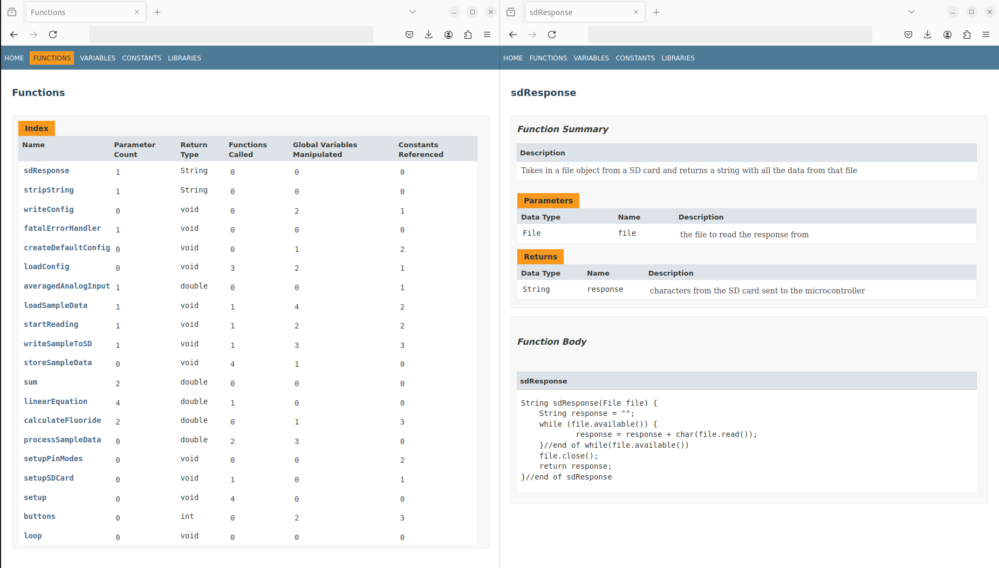

# ArduDoc: Automated Documentation Generator for Arduino Sketches

<p align="center">
  
</p>
<p align="center"><i>Automated documentation generation for Arduino sketches</i></p>

## Overview

This repository contains the code and tools for ArduDoc, a tool designed to automate documentation generation for Arduino sketches. ArduDoc was developed to help Arduino developers quickly generate professional, clear, and detailed documentation from their projects, making it easier to share and maintain code.

ArduDoc streamlines the documentation process by:

1. **Parsing Arduino Sketch Files**: Automatically extracts functions, variables, constants, and libraries from your code.
2. **Generating HTML Documentation**: Produces clean, structured HTML files that document each aspect of your code.

## Setup

1. **Install Python**: Ensure Python is installed on your system (Python 3.6 or higher).
2. **Clone the Repository**:
    ```bash
    git clone https://github.com/ethschan/ArduDoc.git
    ```
3. **Prepare Your Arduino Sketch**: Prepare your Arduino sketch file(s) with documentation following the guidelines below.

4. **Run ArduDoc**: 

   You can test ArduDoc with an example file provided in the repository or use your own Arduino sketch. 

   To run the example:
    ```bash
    python main.py examples/barebones.ino
    ```

   To run with your own sketch:
    ```bash
    python main.py --arduino_sketch path/to/your/sketch.ino [--output <output_directory>] [--overwrite]
    ```

 **Options:**
   - **`--arduino_sketch <path>`**: Specifies the path to the Arduino sketch to generate documentation for.
   - **`--output <directory>`**: Specifies the directory where the documentation will be generated. If not provided, the output will be placed in the `output` directory by default.
   - **`--overwrite`**: Allows ArduDoc to overwrite the specified output directory if it already exists. **Use with caution.**

## Formatting

When documenting your Arduino sketch, it's important to follow a format that ArduDoc can use to parse your code.

Here are some rules to follow: 

- **Labels**: Function blocks must have their fields labelled (`Function Name`, `Description`, `Parameters`, and `Returns`).
- **Types**: List each reference in the format `Type  name  description`.

### Example Format:

A full example can be found under `/examples/barebones.ino`.

```
#include <math.h> //module for mathematical operations
#include <SPI.h> //module for serial peripherals
#include <SD.h> //module for communication to the SD module

#define selectPin 25 //the input pin for the select button
#define enterPin 27 //enterPin  the input pin for the enter button
#define chipSelectPin 4 //chipSelectPin  the chip select pin for the SD card module
#define adcPin A1 //adcPin  the input pin for adc reading

int selectState = 0; //variable for the state of the select button
int enterState = 0; //variable for the state of the enter button

/*
* Function Name:
*
*   sdResponse
*
* Description:
*
*   Takes in a file object from a SD card and returns a string with all the data from that file
*
* Parameters:
*
*   File  file  the file to read the response from
*
* Returns:
*
*   String  response  characters from the SD card sent to the microcontroller
*/
String sdResponse(File file) {
  String response = "";
  while (file.available()) {
      response = response + char(file.read());
  }//end of while(file.available())
  file.close();
  return response;
}//end of sdResponse
```

## Files

- `ardudoc.py`: Main script to run ArduDoc and generate documentation.
- `/lib`: Directory for utility functions and stylesheets used for parsing and processing Arduino sketches.
- `/examples`: Example Arduino sketches to demonstrate ArduDoc's capabilities.


## License

This work is licensed under the [GNU General Public License v3.0](https://www.gnu.org/licenses/gpl-3.0.en.html).